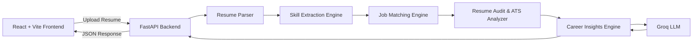

# 🚀 AI Career Mentor

## AI-Driven Skill-to-Employment Mapping Platform

> **An AI-powered web application that analyzes resumes, evaluates career readiness, recommends suitable technology roles, and provides personalized career guidance through intelligent resume analysis.**

---

# 📖 About the Project

Choosing the right career path can be challenging for students and job seekers. Many candidates possess technical knowledge but struggle to understand how well their skills align with industry expectations.

**AI Career Mentor** is an AI-powered career guidance platform that helps users make informed career decisions through intelligent resume analysis. Users can upload their resumes to evaluate their strengths, identify areas for improvement, compare their profiles with different technology roles, and receive personalized career recommendations.

The platform combines resume parsing, AI-powered analysis, job role mapping, and career guidance into a single application. It assists users in improving resume quality, understanding ATS compatibility, discovering relevant learning resources, preparing for interviews, and planning their career growth.

Whether preparing for internships, campus placements, or full-time opportunities, AI Career Mentor provides practical insights that help users become more confident and industry-ready.

---

# 🏆 Achievement

This project secured **2nd Prize** at **HACKFEST (MOBIUS 2K26)** organized by **Thiagarajar College of Engineering**.

The project was recognized for its practical approach to combining Artificial Intelligence, resume analysis, career guidance, and job role recommendation into an interactive web application.

---

# ✨ Features

| Feature                    | Description                                                                                     |
| -------------------------- | ----------------------------------------------------------------------------------------------- |
| 📄 Resume Upload & Parsing | Upload PDF resumes and extract essential information using a robust resume parsing system.      |
| 🤖 AI Career Copilot       | Provides personalized career guidance and answers career-related questions using AI.            |
| 📊 Resume Audit            | Evaluates resumes based on skills, projects, certifications, experience, and ATS compatibility. |
| 🎯 ATS Analyzer            | Identifies formatting issues and suggests improvements for better ATS performance.              |
| 💼 Job Role Mapping        | Matches resumes with suitable technology roles using skill-based analysis.                      |
| 🗺️ Career Roadmap         | Generates personalized learning paths based on selected career goals.                           |
| 📋 Job Description Matcher | Compares resumes with job descriptions and identifies missing keywords and skills.              |
| 💰 Salary Insights         | Displays estimated salary ranges for various technology roles.                                  |
| 🎤 Interview Preparation   | Generates technical and behavioral interview questions based on selected roles.                 |
| 📚 Course Recommendations  | Suggests learning resources to bridge identified skill gaps.                                    |

---

# 🛠️ Technology Stack

| Category            | Technologies                            |
| ------------------- | --------------------------------------- |
| **Frontend**        | React 18, Vite, HTML5, CSS3, JavaScript |
| **Backend**         | FastAPI, Python 3.11, Uvicorn           |
| **AI Model**        | Groq LLM (Llama 3.1 8B Instant)         |
| **PDF Processing**  | pdfjs-dist, pdfplumber, pypdf           |
| **Version Control** | Git, GitHub                             |

---

# 🏗️ System Architecture

The platform follows a modular architecture where the frontend communicates with the backend through REST APIs. The backend processes uploaded resumes, extracts skills, performs analysis, and generates personalized career recommendations using AI.



---

# ⚙️ Project Workflow

The platform processes every uploaded resume through the following workflow:

```text
Resume Upload
      │
      ▼
PDF Parsing
      │
      ▼
Skill Extraction
      │
      ▼
Resume Audit
      │
      ▼
ATS Analysis
      │
      ▼
Job Role Mapping
      │
      ▼
Career Roadmap
      │
      ▼
Interview Preparation
      │
      ▼
AI Career Copilot
```

# 📂 Project Structure

```text
AI-Career-Mentor/
│
├── backend/
│   ├── main.py
│   ├── requirements.txt
│   ├── resume_parser.py
│   ├── insights_engine.py
│   ├── job_matcher.py
│   ├── ats_analyzer.py
│   └── ...
│
├── public/
│
├── src/
│   ├── assets/
│   ├── components/
│   ├── pages/
│   ├── services/
│   ├── utils/
│   ├── App.jsx
│   └── main.jsx
│
├── .env
├── .env.example
├── .gitignore
├── .python-version
├── index.html
├── package.json
├── package-lock.json
├── render.yaml
├── vite.config.js
├── README.md
├── SETUP.md

```
# 🔌 API Reference

The backend provides REST APIs for resume analysis and AI-powered career guidance.

---

## Resume Analysis

### Endpoint

```http
POST /api/upload
```

### Description

Uploads a resume and returns a complete career analysis.

### Request

* Method: `POST`
* Content-Type: `multipart/form-data`
* Parameter: `file`

### Sample Response

```json
{
  "filename": "resume.pdf",
  "career_readiness_score": 82,
  "best_fit_job": "Machine Learning Engineer",
  "best_fit_job_score": 89,
  "resume_audit": {
    "overall_score": 84,
    "grade": "A"
  }
}
```

---

## AI Career Copilot

### Endpoint

```http
POST /api/ai-chat
```

### Description

Provides AI-powered career guidance based on the user's profile and queries.

### Sample Request

```json
{
  "message": "How can I become a Full Stack Developer?",
  "conversation_history": [],
  "context": {
    "skills": [
      "Python",
      "React"
    ]
  }
}
```

### Sample Response

```json
{
  "response": "Based on your current skills, you should strengthen backend development, improve database knowledge, build real-world projects, and practice technical interviews."
}
```

---

# 🔒 Security

The project follows security best practices to protect user information and application resources.

* API keys are stored using environment variables.
* Sensitive credentials are excluded from version control.
* Cross-Origin Resource Sharing (CORS) is configured appropriately.
* Backend and frontend configurations are managed separately.
* Environment-specific settings are stored in `.env` files.

---

# 🚀 Future Enhancements

The following features are planned for future versions of the project:

* User authentication and profile management.
* Resume history and analytics dashboard.
* OCR support for scanned PDF resumes.
* Database integration using PostgreSQL.
* Real-time job recommendations.
* Resume version comparison.
* Company-specific interview preparation.
* Multi-language resume analysis.
* Admin dashboard for monitoring and analytics.
* AI-powered resume builder.

---
# 🔌 API Reference

The backend provides REST APIs for resume analysis and AI-powered career guidance.

---

## Resume Analysis

### Endpoint

```http
POST /api/upload
```

### Description

Uploads a resume and returns a complete career analysis.

### Request

* Method: `POST`
* Content-Type: `multipart/form-data`
* Parameter: `file`

### Sample Response

```json
{
  "filename": "resume.pdf",
  "career_readiness_score": 82,
  "best_fit_job": "Machine Learning Engineer",
  "best_fit_job_score": 89,
  "resume_audit": {
    "overall_score": 84,
    "grade": "A"
  }
}
```

---

## AI Career Copilot

### Endpoint

```http
POST /api/ai-chat
```

### Description

Provides AI-powered career guidance based on the user's profile and queries.

### Sample Request

```json
{
  "message": "How can I become a Full Stack Developer?",
  "conversation_history": [],
  "context": {
    "skills": [
      "Python",
      "React"
    ]
  }
}
```

### Sample Response

```json
{
  "response": "Based on your current skills, you should strengthen backend development, improve database knowledge, build real-world projects, and practice technical interviews."
}
```

---

# 🔒 Security

The project follows security best practices to protect user information and application resources.

* API keys are stored using environment variables.
* Sensitive credentials are excluded from version control.
* Cross-Origin Resource Sharing (CORS) is configured appropriately.
* Backend and frontend configurations are managed separately.
* Environment-specific settings are stored in `.env` files.

---

# 🚀 Future Enhancements

The following features are planned for future versions of the project:

* User authentication and profile management.
* Resume history and analytics dashboard.
* OCR support for scanned PDF resumes.
* Database integration using PostgreSQL.
* Real-time job recommendations.
* Resume version comparison.
* Company-specific interview preparation.
* Multi-language resume analysis.
* Admin dashboard for monitoring and analytics.
* AI-powered resume builder.

---
# 🤝 Contributing

Contributions are welcome and appreciated.

If you would like to contribute to this project, follow these steps:

1. Fork the repository.
2. Create a new feature branch.
3. Make your changes.
4. Commit your changes with a meaningful commit message.
5. Push the branch to your fork.
6. Open a Pull Request for review.

Please ensure your code follows the existing project structure and coding standards.

---

# 👨‍💻 Authors

## Pradakshina Saravanan

**Role**

* Frontend Development
* UI/UX Design
* Testing
* Documentation

---

## Prasanna Ganesan

**Role**

* Backend Development
* API Development
* AI Integration

---

# 🙏 Acknowledgements

Special thanks to:

* Thiagarajar College of Engineering
* HACKFEST (MOBIUS 2K26)
* Groq AI
* React Community
* FastAPI Community
* Open Source Contributors

---

## 📌 Project Summary

**AI Career Mentor** is an AI-powered career guidance platform that bridges the gap between academic skills and industry requirements. Through intelligent resume analysis, AI-driven recommendations, ATS evaluation, job role mapping, interview preparation, and personalized learning guidance, the platform helps students and job seekers make informed career decisions and improve their employability.


