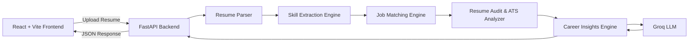

# 🚀 AI Career Mentor
### AI-Driven Skill-to-Employment Mapping Platform

> **An AI-powered web application that analyzes resumes, evaluates career readiness, recommends suitable technology roles, and provides personalized career guidance through intelligent resume analysis.**

<p align="center">
  🏆 <strong>2nd Prize Winner – HACKFEST (MOBIUS 2K26)</strong><br>
  Thiagarajar College of Engineering
</p>

---

<p align="center">
  
</p>

<p align="center">
  
  
  
  
  
</p>

---

# 📖 About the Project

Choosing the right career path is often challenging for students and job seekers. Many candidates have technical knowledge but struggle to understand how well their skills align with current industry requirements.

**AI Career Mentor** is an AI-powered career guidance platform that helps users make informed career decisions through intelligent resume analysis. By uploading a resume, users can explore their strengths, identify improvement areas, compare their profile with different technology roles, and receive personalized recommendations to enhance their employability.

The platform combines resume parsing, AI-powered analysis, job role mapping, and career guidance into a single application. It assists users in improving resume quality, understanding ATS compatibility, discovering relevant learning resources, preparing for interviews, and planning their career growth.

Whether preparing for internships, campus placements, or full-time opportunities, AI Career Mentor provides practical insights that help users become more confident and industry-ready.

---

# 🏆 Achievement

This project secured **2nd Prize** at **HACKFEST (MOBIUS 2K26)** organized by **Thiagarajar College of Engineering**.

The project was recognized for its practical approach to combining Artificial Intelligence, resume analysis, career guidance, and job role recommendation into an interactive web application.

---

# ✨ Core Features

| Feature | Description |
|----------|-------------|
| 📄 **Resume Upload & Parsing** | Upload PDF resumes and extract information using a multi-layer resume parsing system with reliable fallback mechanisms. |
| 🤖 **AI Career Copilot** | Context-aware AI assistant that provides career guidance and answers user queries using Groq LLM. |
| 📊 **Resume Audit** | Evaluates resumes across experience, skills, certifications, projects, and ATS compatibility. |
| 🎯 **ATS Deep Analyzer** | Checks resume structure and highlights improvements to increase ATS compatibility. |
| 💼 **Job Role Mapping** | Matches resumes with multiple technology roles using weighted skill matching algorithms. |
| 🗺️ **Career Roadmap** | Generates personalized learning paths based on selected career goals. |
| 📋 **JD Matcher** | Compares resume content with job descriptions to identify matching and missing keywords. |
| 💰 **Salary Insights** | Displays estimated salary ranges for different technology roles and experience levels. |
| 🎤 **Interview Preparation** | Generates role-specific technical and behavioral interview questions. |
| 🔗 **LinkedIn Optimizer** | Provides AI-powered recommendations to improve LinkedIn profiles. |
| 📚 **Course Recommendations** | Suggests curated learning resources based on identified skill gaps. |

---

# 📸 Application Showcase

<p align="center">
  
</p>

The application provides an interactive dashboard where users can upload resumes, explore job role recommendations, analyze resume quality, compare job descriptions, prepare for interviews, and interact with the AI Career Copilot through a unified interface.

# 🏗️ System Architecture

The platform follows a modular architecture where the frontend communicates with the backend through REST APIs. The backend processes resumes, extracts skills, performs analysis, and interacts with the AI model to generate personalized career insights.



---

# ⚙️ Platform Workflow

The platform processes every uploaded resume through a structured pipeline.

```text
Resume Upload
      │
      ▼
PDF Parsing
      │
      ▼
Skill Extraction
      │
      ▼
Resume Audit
      │
      ▼
ATS Analysis
      │
      ▼
Job Role Mapping
      │
      ▼
Career Roadmap
      │
      ▼
Interview Preparation
      │
      ▼
AI Career Copilot
```

---

# 🛠️ Technology Stack

| Category | Technologies |
|----------|--------------|
| **Frontend** | React 18, Vite, HTML5, CSS3, JavaScript |
| **Backend** | FastAPI, Python 3.11, Uvicorn |
| **AI** | Groq LLM (`llama-3.1-8b-instant`) |
| **PDF Processing** | pdfjs-dist, pdfplumber, pypdf |
| **Hosting** | GitHub Pages, Render |
| **Version Control** | Git & GitHub |

---

# 📂 Project Structure

```text
AI-Career-Mentor/
│
├── backend/
│   ├── main.py
│   ├── requirements.txt
│   ├── insights_engine.py
│   ├── resume_parser.py
│   ├── job_matcher.py
│   └── ...
│
├── docs/
│   └── screenshots/
│
├── public/
│
├── src/
│   ├── components/
│   ├── pages/
│   ├── services/
│   ├── utils/
│   └── assets/
│
├── .github/
│   └── workflows/
│
├── package.json
├── vite.config.js
├── README.md
└── LICENSE
```

---

# 💻 Installation Guide

## Prerequisites

Before running the project locally, ensure the following software is installed:

- Python **3.11** or later
- Node.js **18** or later
- npm
- Git

---

## 1️⃣ Clone the Repository

```bash
git clone https://github.com/your-username/your-repository.git

cd your-repository
```

---

## 2️⃣ Backend Setup

Navigate to the backend directory.

```bash
cd backend
```

Create a virtual environment.

```bash
python -m venv .venv
```

Activate the virtual environment.

### Windows

```bash
.venv\Scripts\activate
```

### Linux / macOS

```bash
source .venv/bin/activate
```

Install the required packages.

```bash
pip install -r requirements.txt
```

Create the environment file.

```bash
cp .env.example .env
```

Open the `.env` file and add your Groq API Key.

```
GROQ_API_KEY=your_api_key
```

Start the backend server.

```bash
python main.py
```

The backend will run on:

```
http://localhost:8000
```

---

## 3️⃣ Frontend Setup

Open a new terminal.

Return to the project root.

```bash
cd ..
```

Install the frontend dependencies.

```bash
npm install
```

Create the frontend environment file.

```bash
echo VITE_GROQ_API_KEY=your_key_here > .env.local
```

Run the frontend application.

```bash
npm run dev
```

The frontend will be available at:

```
http://localhost:5173
```

---

## ✅ Verify the Installation

After starting both servers:

- Upload a sample resume.
- Check whether the resume analysis is generated.
- Verify job role recommendations.
- Test the AI Career Copilot.
- Explore Resume Audit and Career Roadmap sections.

---
# ☁️ Deployment

The application can be deployed using **GitHub Pages** for the frontend and **Render** for the backend.

## Backend Deployment (Render)

1. Create a new **Web Service** in Render.
2. Select the repository and set the **Root Directory** as `backend`.
3. Configure the following:

| Setting | Value |
|----------|-------|
| Build Command | `pip install -r requirements.txt` |
| Start Command | `uvicorn main:app --host 0.0.0.0 --port $PORT` |

### Environment Variables

```
GROQ_API_KEY=your_groq_api_key
FRONTEND_URL=https://your-frontend-url
```

---

## Frontend Deployment (GitHub Pages)

The frontend is configured for deployment using **GitHub Actions**.

Configure the following GitHub Secrets:

| Secret | Description |
|---------|-------------|
| `VITE_API_URL` | Backend API URL |
| `VITE_GROQ_API_KEY` | Groq API Key |

After pushing the code to the `main` branch, GitHub Actions will automatically build and deploy the frontend.

---

## 🌐 Live Application

| Service | URL |
|----------|-----|
| 🚀 Frontend | https://your-live-url |
| 🔗 Backend API | https://your-api-url |
| ❤️ Health Check | https://your-api-url/health |

---

# 🔌 API Reference

## POST `/api/upload`

Uploads a resume and returns a complete resume analysis.

### Request

- Method: `POST`
- Content Type: `multipart/form-data`
- Parameter: `file`

### Sample Response

```json
{
  "filename": "resume.pdf",
  "career_readiness_score": 82,
  "best_fit_job": "Machine Learning Engineer",
  "best_fit_job_score": 89,
  "resume_audit": {
    "overall_score": 84,
    "grade": "A"
  }
}
```

---

## POST `/api/ai-chat`

Provides AI-powered career guidance.

### Sample Request

```json
{
  "message": "How can I become a Full Stack Developer?",
  "conversation_history": [],
  "context": {
    "skills": [
      "Python",
      "React"
    ]
  }
}
```

### Sample Response

```json
{
  "response": "Based on your current skills, you should strengthen backend development, improve database knowledge, and build more full-stack projects."
}
```

---

# 🔒 Security

The project follows basic security practices to protect sensitive information.

- API keys are stored using environment variables.
- Sensitive credentials are excluded from version control.
- CORS is configured to restrict unauthorized requests.
- Environment-specific configuration is managed using `.env` files.
- Backend and frontend configurations are separated for better security.

---

# 🚀 Future Enhancements

The following improvements are planned for future releases:

- [ ] User authentication and profile management.
- [ ] Resume history and analytics dashboard.
- [ ] OCR support for scanned PDF resumes.
- [ ] Database integration using PostgreSQL.
- [ ] Real-time job recommendations.
- [ ] Resume version comparison.
- [ ] Company-specific interview preparation.
- [ ] Multi-language resume analysis.
- [ ] Admin dashboard for monitoring.
- [ ] AI-powered resume builder.

---

# 🤝 Contributing

Contributions are welcome!

If you would like to improve the project:

1. Fork the repository.
2. Create a new feature branch.
3. Commit your changes.
4. Push the branch.
5. Open a Pull Request.

Please ensure that your code follows the existing project structure and coding standards.

---

# 👨‍💻 Authors

## Pradakshina Saravanan

- Frontend Development
- UI/UX Design
- Testing & Documentation

---

## Prasanna Ganesan

- Backend Development
- API Development
- AI Integration

---

# 🙏 Acknowledgements

Special thanks to:

- Thiagarajar College of Engineering
- HACKFEST (MOBIUS 2K26)
- Groq AI
- React Community
- FastAPI Community
- Open Source Contributors

---

# 📜 License

This project is licensed under the **MIT License**.

See the **LICENSE** file for more information.

---

<p align="center">

Made with ❤️ using React, FastAPI and Artificial Intelligence.

⭐ If you found this project useful, consider giving it a star on GitHub!

</p>


