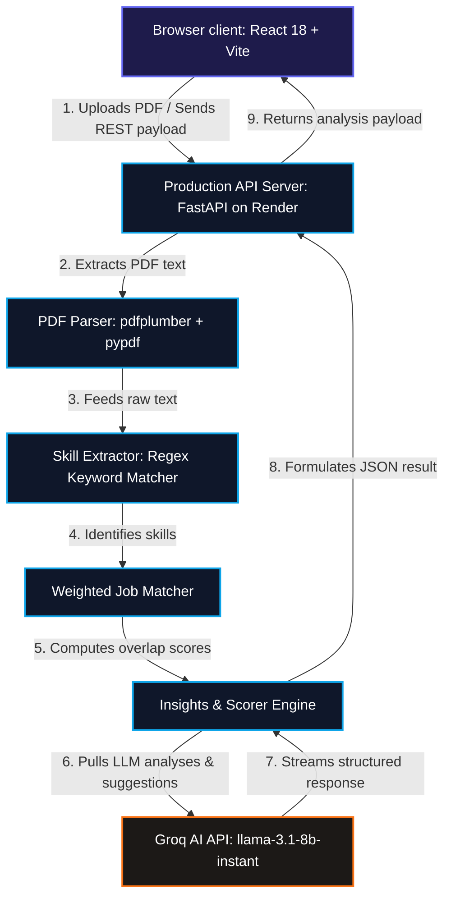

# 🤖 AI-Driven Skill-to-Employment Mapping Platform

> **AI Career Mentor** maps your resume skills to real-world job opportunities with weighted matching, step-by-step career roadmaps, job description (JD) comparisons, interview prep, LinkedIn profile optimization, and a context-aware AI Career Copilot.

---

<p align="center">
  
</p>

<p align="center">
  
  
  
  
  
  
</p>

<p align="center">
  🏆 <b>2nd Prize — HACKFEST (MOBIUS 2K26)</b> · Thiagarajar College of Engineering
</p>

---

## ⚡ Quick Links
* **Live Web Application:** [https://prasannaganesann.github.io/AI-Career-Mentor/](https://prasannaganesann.github.io/AI-Career-Mentor/)
* **Production API Server:** [https://ai-career-mentor-api-2olt.onrender.com](https://ai-career-mentor-api-2olt.onrender.com)
* **Backend Health Check:** [https://ai-career-mentor-api-2olt.onrender.com/health](https://ai-career-mentor-api-2olt.onrender.com/health)

---

## 🌟 Core Features

| Feature | Description | Tech Highlight |
| :--- | :--- | :--- |
| 📄 **3-Tier Resume Upload** | High-precision PDF parser with client-side, backend, and mock fallback tiers. | `pdfjs-dist` + `pdfplumber` |
| 🤖 **AI Career Copilot** | Context-aware chatbot that answers career queries and auto-navigates tabs based on user intent. | Groq AI (`llama-3.1-8b-instant`) |
| 📊 **Resume Audit** | Evaluates resumes across 5 key dimensions (experience, skills, ATS compatibility, certs, projects). | Custom Scorer Engine |
| 🎯 **ATS Deep Analyzer** | Displays a checklist of structural checks and lists high-priority action items. | Schema Normalizer |
| 💼 **Job Mapping** | Matches resumes against 15+ tech roles with weighted scoring (Core Skills = 70%, Other = 30%). | Overlap Algorithms |
| 🗺️ **Career Roadmap** | Outlines prioritized learning steps to reach target roles with time-to-hire estimates. | `insights_engine.py` |
| 📋 **JD Matcher** | Compares resume text with any pasted job description to show keyword matches. | Regex keyword matching |
| 💰 **Salary Insights** | Details entry, mid, and senior salary ranges across all roles with remote-friendly indicators. | Static Fallbacks + REST API |
| 🎤 **Interview Prep** | Role-specific coding and behavioral questions with client-side Groq custom generators. | `groqClient.js` |
| 🔗 **LinkedIn Optimizer** | Generates detailed LinkedIn profile optimization tips. | LLM Analysis |
| 📚 **Courses Panel** | Maps skill gaps to over 70 curated courses with platform colors and levels. | `courseEngine.js` |

---

## 📸 Interface Showcase

<p align="center">
  
</p>

---

## 📐 System Architecture

The following flowchart outlines the platform's multi-layered architecture:



---

## 🛠️ Tech Stack

* **Frontend:** React 18, Vite, HSL-themed CSS (Glassmorphism), PDF.js (`pdfjs-dist`)
* **Backend:** FastAPI, Uvicorn, Python 3.11, `pypdf`, `pdfplumber`
* **Infrastructure:** GitHub Pages (Static hosting), Render Free Tier (API hosting)
* **AI & NLP:** Groq AI Cloud (`llama-3.1-8b-instant`), Word-Boundary regex matcher

---

## 💻 Installation & Local Running

### Prerequisites
* Python 3.11 / 3.12 / 3.13 / 3.14
* Node.js v18+ and npm

### 1. Backend Setup
1. Navigate to the `backend/` subfolder:
   ```bash
   cd backend
   ```
2. Create and activate a Python virtual environment:
   ```bash
   python -m venv .venv
   # Windows:
   .venv\Scripts\activate
   # Linux/macOS:
   source .venv/bin/activate
   ```
3. Install dependencies:
   ```bash
   pip install -r requirements.txt
   ```
4. Copy the environment variables template and add your API key:
   ```bash
   cp .env.example .env
   ```
   *Edit `.env` and add your `GROQ_API_KEY` from console.groq.com.*
5. Run the FastAPI development server:
   ```bash
   python main.py
   ```
   *The backend will boot on [http://localhost:8000](http://localhost:8000).*

### 2. Frontend Setup
1. Navigate to the repository root directory:
   ```bash
   cd ..
   ```
2. Install npm dependencies:
   ```bash
   npm install
   ```
3. Create a local environment variables file:
   ```bash
   echo VITE_GROQ_API_KEY=your_key_here > .env.local
   ```
4. Run the Vite development server:
   ```bash
   npm run dev
   ```
   *Open [http://localhost:5173](http://localhost:5173) in your browser.*

---

## ☁️ Production Deployment

### 1. Deployed Backend (Render)
* Create a **Web Service** on [Render.com](https://render.com/).
* Root Directory: `backend`
* Build Command: `pip install -r requirements.txt`
* Start Command: `uvicorn main:app --host 0.0.0.0 --port $PORT`
* Environment Variables:
  * `GROQ_API_KEY`: *Your Groq API key*
  * `FRONTEND_URL`: `https://prasannaganesann.github.io`

### 2. Deployed Frontend (GitHub Pages)
The repository contains a pre-configured GitHub Actions workflow (`.github/workflows/deploy.yml`) that builds and deploys the frontend React application automatically on pushes to the `main` branch. 
* Add `VITE_GROQ_API_KEY` to **GitHub Secrets** for client-side fallback parsing.
* Add `VITE_API_URL` to **GitHub Secrets** pointing to your Render backend URL (e.g., `https://your-api.onrender.com/api`) to connect the frontend to the backend.

---

## 🔌 API Overview

### `POST /api/upload`
Uploads a PDF resume and returns a full career mapping analysis and visual resume audit.
* **Payload:** `multipart/form-data` with `file` key containing the PDF.
* **Response:**
  ```json
  {
    "filename": "resume.pdf",
    "extracted_text_preview": "...",
    "career_readiness_score": 75,
    "best_fit_job": "Machine Learning Engineer",
    "best_fit_job_score": 85,
    "top_3_matches": [...],
    "job_matches": [...],
    "resume_audit": {
      "overall_score": 72,
      "grade": "B",
      "grade_label": "Strong Resume",
      "dimensions": { ... }
    }
  }
  ```

### `POST /api/ai-chat`
Context-aware LLM chatbot endpoint.
* **Payload:**
  ```json
  {
    "message": "How do I become an AI Engineer?",
    "conversation_history": [],
    "context": { "extracted_skills": ["Python"] }
  }
  ```
* **Response:** `{"response": "..."}`

---

## 🔒 Security Hardening
* **CORS Restrictions:** Locked API endpoints prevent unauthorized requests from external domains.
* **No Exposed Keys:** All secrets are stored safely in `.env` (locally) and GitHub Actions Secrets/Render Dashboard in production.
* **Locked Environments:** Lock runtimes via `.python-version` files.

---

## 🗺️ Development Roadmap
- [ ] Implement database integration (PostgreSQL) for user accounts and analytics.
- [ ] Add real-time PDF scanning support for scanned image resumes (OCR integration).
- [ ] Incorporate interactive coding test workspaces in the Interview tab.
- [ ] Implement backend rate-limiting middleware to prevent API spam.

---

## 📝 License
Distributed under the MIT License. See [LICENSE](LICENSE) for details.

---

## 👨‍💻 Authors & Acknowledgement
* **TCE HACKFEST Team Members:** Thiagarajar College of Engineering hackathon submission.
* Developed for **MOBIUS 2K26**, winning **2nd Place**!
